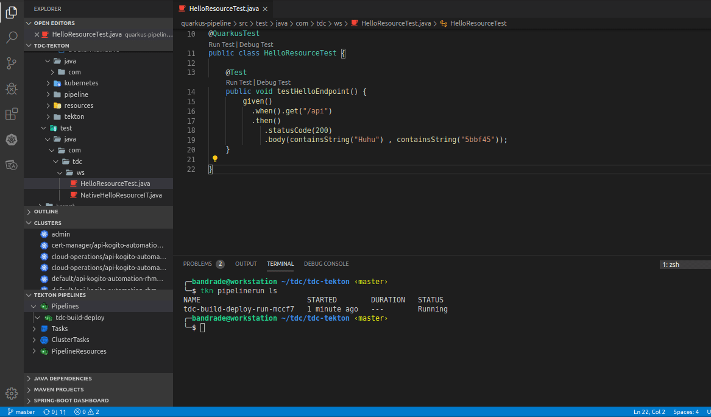

# tdc-tekton
### Introduction

This is an example to demonstrate how an integration of [Tekton VSCode Plugin](https://github.com/redhat-developer/vscode-tekton), [Quarkus](https://quarkus.io/) , [Tekton](https://github.com/tektoncd/pipeline) and [Openshift Pipelines](https://github.com/openshift/tektoncd-pipeline) can be very productive for Developers. 

- Development Environment, work in your application code and monitor the pipeline run in the same screen:



- Follow up the `PipelineRun` progress at `Pipeline View` in Developer Mode at `Openshift 4.2+`:


- Let the microservice dependencies be automatically created and deployed by it  own pipeline. The application is created using Quarkus by [Burr Sutter](https://github.com/burrsutter) and can be found at https://github.com/burrsutter/blue-green-canary


### Pre Requisites

To run this demo,  below are the tools that must be installed:

- Openshift 4.2+ Cluster with [Openshift Pipelines Operator](https://github.com/openshift/tektoncd-pipeline-operator) installed 
- [Tekton CLI](https://github.com/tektoncd/cli) configured in your PATH
- Vscode with [Tekton Plugin](https://github.com/redhat-developer/vscode-tekton) installed

### How to run 

In your cluster create a project called demo:

```
oc new-project demo
```

Clone the project:

```bash
git clone https://github.com/msmagnanijr/tdc-tekton.git
cd tdc-tekton
```

Create the service and route:

```bash
./create_service_and_route.sh
```

Create the pipeline objects:

```bash
./create_pipeline_objects.sh  
```

Create the pipeline run:

```
./create_pipelinerun.sh
```

Check your project route with the following command:

```
oc get route -n demo 
NAME      HOST/PORT                                     PATH   SERVICES   PORT   TERMINATION   WILDCARD
tdc-app   tdc-app-demo.apps.sample.automation.io          tdc-app    http                 None
```

Access the route and you should check the application running.